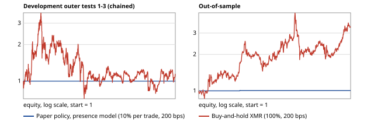

# Forced Laundering Demand: Do Large Crypto Thefts Predict Monero Gains?

**Santiago Otoya, Camilo Nunez** · Gator Quant Hacks 2026, Systematic Trading track · Code: https://github.com/SantiagoOtoya/xrm-laundering-flow

## 1. Summary

**Edge tested:** after a crypto theft above $5M becomes public, attackers must buy XMR (Monero) to launder traceable funds, so XMR should be more likely to rise over the next 120 hours. **Test:** an hourly L2 logistic forecast of P(XMR 120-hour return > 3%), with and without a "qualifying theft reported in the last 24 h" input, scored on purged chronological folds against a pre-registered decision rule. **Result:** the hypothesis was **not supported** in development: adding the incident input made pooled log loss worse (0.6400 vs 0.6377; pre-registered bootstrap p = 1.0). Out-of-sample it was slightly better but **not significant** (0.63486 vs 0.63524; p = 0.131). The paper policy **barely traded**: 0 trades in development and 1 out-of-sample (+0.69% of equity, vs +234.33% for buy-and-hold XMR). **What we learned:** with day-level, retrospective incident dates the effect, if it exists, is too small or too early to capture; a real test needs hour-stamped disclosures.

## 2. Economic hypothesis

Pre-registered in `HYPOTHESIS.md` (commit `35f8452`) before any model result was seen; Amendment 1 (commit `347590f`) fixed incident timing and the decision rule before the incident models were scored.

- **Source of the edge (structural constraint).** A thief holding tokens on a transparent chain has hours to days before addresses are flagged and issuers or exchanges freeze funds. Converting into XMR, which hides sender, receiver and amount, is one of the few ways to keep the proceeds. That demand is forced and price-insensitive: a frozen dollar is worth nothing to the attacker.
- **Who is on the other side.** Existing XMR holders and market makers, who sell into the flow without knowing a large conversion is coming.
- **Why it would persist.** The demand is compelled and arrives in bursts tied to disclosures; exchange delistings of XMR have thinned liquidity, so few arbitrageurs can hold or source XMR at scale ahead of the flow.
- **What would kill it.** No forecast improvement over a market-only model; an improvement that disappears at 2× costs; launderers switching to bridges, mixers or other privacy coins; or the move being priced in before our hourly decision.

## 3. Data

**Prices.** Hourly UTC bars, 2017-01-02 to 2026-10-03 (85,464 hours). XMR/USD is built per minute: the Kraken XMR/USD close when Kraken traded that minute, otherwise Binance XMR/BTC × Kraken BTC/USD from the same minute; the hourly close is the last priced minute, and nothing is forward-filled. 35,371 hourly closes are Binance-derived, the selected source switches between adjacent hours 20,843 times, and the median absolute venue gap over 1,006,922 shared minutes is 0.10%. BTC/USD is Kraken only.

**Incidents.** 588 theft incidents over $1M from DefiLlama, SlowMist Hacked, rekt.news and linked primary sources; 302 exceed $5M, 41 of them in the hurdle-selection period A. Dates are day-level; an incident counts as public from 00:00 UTC the day after its latest source date. Sources: `docs/DATA_SOURCES.md`.

## 4. Methodology

**Target and features.** At each hour t, y = 1 if P(t+120h)/P(t) − 1 > h. Eight standardized features: (1–2) XMR log return over the last 24 h and the 6 days before; (3–4) the same for BTC; (5) XMR 24-hour realized volatility; (6) qualifying incident in the last 24 h; (7) log known loss; (8) incident age in hours.

| Model | Inputs | Role |
| --- | --- | --- |
| Prevalence | constant (training base rate) | reference |
| Market baseline | features 1–5 | comparator |
| **Presence** | **features 1–6** | **primary test (Amendment 1); drives the paper policy** |
| Full | features 1–8 | secondary; feature 7 uses final catalog losses (lookahead) |

**Validation.** L2-regularized logistic regression, λ ∈ {0.01, 0.1, 1.0} chosen by inner-fold log loss. Expanding, purged chronological folds: period A 2017-01-02 to 2020-11-26 (hurdle selection only); outer tests 2020-11-26 → 2022-03-15 16:00 → 2023-07-03 08:00 → 2024-10-20; out-of-sample (OOS, last 20%) 2024-10-20 → 2026-10-03, scored once. Every boundary drops rows whose 120-hour label crosses it, using timestamps, not row counts. The hurdle h ∈ {3%, 4%, 5%} is chosen inside A by the paper policy's mean daily log return, subject to ≥ 10 trades and no fold drawdown worse than 10%.

**Paper policy (fixed).** When flat and p ≥ 0.60, buy XMR with 10% of equity, hold 120 hours; one position, long only, no leverage or stops. **Costs:** 100 bps per side, 200 bps round trip: an 80 bps taker fee per side (conservative, above Kraken Pro's published lowest-tier taker fee) plus a 20 bps spread/slippage allowance. Every economic result is also shown at 2× costs.

**Decision rule (pre-registered).** Statistic: mean over pooled outer-test rows of (baseline − presence) per-row log loss. Circular block bootstrap, 168-hour blocks (covering the 120-hour label overlap and 168-hour lookback), 10,000 resamples, seed 20261004. Supported if one-sided p < 0.05.

## 5. Results

**Table A. Development outer tests (h = 3%).** Log loss / Brier / AUC.

| Model | Outer 1 (10,668 h) | Outer 2 (10,767 h) | Outer 3 (7,104 h) | Pooled (28,539 h) |
| --- | --- | --- | --- | --- |
| Prevalence | 0.6849 / 0.2458 / 0.500 | 0.6377 / 0.2226 / 0.500 | 0.5809 / 0.1949 / 0.500 | 0.6412 / 0.2244 / 0.532 |
| Market baseline | 0.6850 / 0.2459 / 0.484 | 0.6366 / 0.2221 / 0.582 | 0.5684 / 0.1891 / 0.640 | 0.6377 / 0.2228 / 0.544 |
| **Presence** | 0.6851 / 0.2459 / 0.489 | 0.6366 / 0.2221 / 0.576 | 0.5773 / 0.1932 / 0.608 | 0.6400 / 0.2238 / 0.542 |
| Full (lookahead) | 0.6851 / 0.2459 / 0.482 | 0.6366 / 0.2221 / 0.573 | 0.5773 / 0.1932 / 0.613 | 0.6400 / 0.2238 / 0.541 |

The pooled prevalence AUC exceeds 0.5 because its constant differs by fold.

**Primary test.** Pre-registered bootstrap (`scripts/preregistered_bootstrap.py`, no refitting, from saved per-row predictions): mean (baseline − presence) log loss = **−0.00224**, 95% interval [−0.00338, −0.00117], **one-sided p = 1.0** (positive would favour presence). **Not supported.** As run in the training code (300 draws, seed 17): presence − baseline 95% interval [+0.0012, +0.0034], the same conclusion. Most of the gap comes from outer 3 (presence − baseline interval [+0.0052, +0.0123]); outers 1 and 2 intervals straddle zero.

**Table B. Out-of-sample, frozen models, 9,716 hours.**

| Model | Log loss | Brier | AUC |
| --- | --- | --- | --- |
| Prevalence | 0.635583 | 0.221744 | 0.500 |
| Market baseline | 0.635243 | 0.221580 | 0.512 |
| **Presence** | 0.634859 | 0.221396 | 0.515 |
| Full (lookahead) | 0.634900 | 0.221418 | 0.515 |

Pre-registered bootstrap on OOS: mean (baseline − presence) = +0.00038, 95% interval [−0.00025, +0.00107], **one-sided p = 0.131**: not significant. As run (300 draws): [−0.0011, +0.0003]. In the 1,111 incident-active hours (73 distinct incidents) presence log loss was 0.674270 vs 0.676815 for the baseline; in the 8,605 ordinary hours, 0.629771 vs 0.629876.

**Table C. Economics, presence-model paper policy vs benchmarks.** Annualized figures are from daily equity marks (`scripts/note_metrics.py`); Sharpe uses a zero risk-free rate.

| | Dev outers 1 / 2 / 3, 1× and 2× | OOS 1× | OOS 2× | Buy-and-hold XMR, dev 1 / 2 / 3 | Buy-and-hold XMR, OOS | Cash |
| --- | --- | --- | --- | --- | --- | --- |
| Net return | 0.00% each | +0.69% | +0.49% | +39.73% / −12.94% / −7.41% | +234.33% | 0% |
| Annualized return | 0.00% | +0.35% | +0.25% | +29.4% / −10.1% / −5.8% | +85.5% | 0% |
| Annualized volatility | 0.00% | 0.55% | 0.59% | 117.0% / 66.0% / 52.5% | 76.8% | 0% |
| Sharpe | n/a (no trades) | 0.64 (1 trade) | 0.43 (1 trade) | 0.79 / 0.17 / 0.23 | 1.27 | n/a |
| Max drawdown | 0.00% | 0.74% | 0.74% | 74.3% / 66.3% / 42.3% (observed marks) | 64.3% (observed) | 0% |
| Turnover (× equity / yr) | 0 | 0.11 | 0.11 | 1.86 / 1.46 / 1.50 | 2.23 | 0 |
| Completed trades | 0 | 1 | 1 | 1 per block | 1 | 0 |

Buy-and-hold holds 100% of equity; the policy at most 10%. Buy-and-hold Sharpe uses mean daily simple returns, so it can be positive when the period return is negative. Hurdle selection: no hurdle met the constraints in A, so the pre-declared 3% fallback was used and no tradable edge is claimed. The market and full models produced the same single OOS trade (entry 2025-04-28 15:00 UTC, +6.92% net on the position), so it is not an incident signal.

**Why it failed.**
1. **Forecasts rarely reach 0.60.** With a base rate near 33% for a > 3% five-day gain, the regularized models stay near it: every development presence forecast lies between 0.362 and 0.412, and the OOS maximum is 0.702. So the policy almost never trades, whatever the incident input does.
2. **Day-after timing.** Incidents switch on at 00:00 UTC the day after the source date; any first-day reaction is already gone.
3. **Retrospective qualification.** The $5M filter and dates come from a catalog compiled after the fact, which blurs which incidents were known when.
4. **Few incidents in A.** Only 41 qualifying incidents fall in the hurdle-selection period.
5. **Venue-switching noise.** 20,843 source switches add apparent returns that the model cannot separate from real moves.

## 6. Risk management

- **Sizing and exposure:** 10% of equity per trade, one position, long only, no leverage, fixed 120-hour exit. The policy carries full XMR price risk while in a trade; nothing hedges it.
- **Maximum loss per trade:** 10% of equity plus costs, if XMR went to zero during the hold. The realized OOS drawdown was 0.74%.
- **Pre-set de-risking:** a hurdle is rejected if any selection fold draws down more than 10%; nothing is re-tuned after outer tests or OOS.
- **Cost stress:** all economics at 2× costs (400 bps round trip).
- **Data risk:** missing or stale prices are never filled; a trade with no exit price stays "unresolved" and is reported.

## 7. Liquidity and capacity

Median Binance XMR/BTC hourly volume, converted to USD, was about $464k in outer 1, $186k in outer 2 and $138k in outer 3 up to the Binance delisting (2024-02-20); Kraken volume is not in this repository, and no Binance volume exists for the OOS period. A $1M account would trade $100k per entry, a large fraction of one hour's Binance volume in 2023–24, so a single-hour fill is unrealistic above small size. Liquidity keeps falling as venues delist XMR. The 200 bps cost is a planning estimate, not a measured or size-dependent cost.

## 8. Limitations and disclosure

- **Timing:** for 271 of 302 qualifying incidents the source date equals the hack date, so a theft disclosed days later is timed too early.
- **Hindsight:** the $5M test uses retrospective amounts (583 of 588 rows), so qualification itself has lookahead; feature 7 (full model) uses final losses.
- **Coverage:** the catalog is assumed complete above $5M; 2017–18 coverage may be thin. 35,371 closes are Binance-derived.
- **Deviations from the pre-registered spec:** the training code's bootstrap used 300 draws, seed 17 and a two-sided interval (the pre-registered 10,000-draw version is reported above, computed afterwards from saved predictions); the paper policy fills one hour after the signal; the 3% hurdle was inherited from the price-only model's selection. This is harmless here because no hurdle qualified and the 3% fallback applies either way.
- **Prior inspection:** the market baseline's outer-test scores were viewed before Amendment 1; nothing in the specification changed after that. The reserved OOS period had been inspected earlier in the project for a different strategy; nothing from that work is used.

## 9. Variants tried

| Item | Count |
| --- | --- |
| Hurdles (selection in A, on the price-only model) | 3 (3%, 4%, 5%) |
| λ values per fit | 3 |
| Model comparisons | 4 (prevalence, baseline, presence, full) |
| Data constructions | 1 combined Kraken/Binance series (Amendment 1) |
| OOS runs | 1 |
| Earlier, different strategy in this project | 1 (not used; see disclosure) |

All 3 × 3 × 4 combinations were evaluated inside development only.

## 10. Next steps

A live incident logger that timestamps each first public report to the hour and records the loss as known at that moment would remove both lookahead sources and allow entry within hours, not the next day. Adding more XMR venues (and their volumes) would cut venue-switching noise and let us measure capacity. The frozen model can then be tested prospectively on data that did not exist when it was built.

## References

- Kraken, downloadable OHLCVT data: https://support.kraken.com/articles/360047124832 ; fee schedule: https://www.kraken.com/features/fee-schedule
- Binance public data, XMRBTC 1-minute klines: https://data.binance.vision/?prefix=data/spot/monthly/klines/XMRBTC/1m/
- DefiLlama hacks; SlowMist Hacked; rekt.news. Full list in `docs/DATA_SOURCES.md`.
- López de Prado, M. (2018). *Advances in Financial Machine Learning*. Wiley (purged cross-validation).
- scikit-learn, TimeSeriesSplit and nested cross-validation: https://scikit-learn.org/stable/modules/cross_validation.html
- Politis, D. & Romano, J. (1992). A circular block-resampling procedure for stationary data. *Exploring the Limits of Bootstrap*, Wiley.
