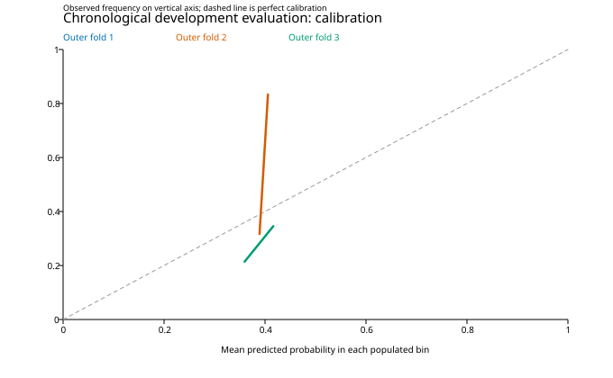

# Price-only training report

Completed locally on 2026-10-04 using the frozen amended NEWMODELS.MD protocol. No incident data entered this run. The data files and strict quality rules were retained.

## Target, inputs and populations

**Target:** probability that completed-close gross XMR/USD return over the next 120 hours is strictly greater than **3%**. Equality and all smaller returns are class 0. The 3% hurdle is the predeclared descriptive fallback: all three candidate hurdles produced zero initial selection trades and failed the ten-trade minimum. It is not an economically selected optimum.

Inputs are the five frozen predictors: XMR latest 24-hour log return, XMR preceding six-day log return, the corresponding two BTC returns, and XMR 24-hour realized volatility. XMR comes from `data/analysis/xmr_usd_btc_combined_1h.csv`; BTC comes from `data/analysis/btc_usd_1h.csv`. BTC is a predictor, with no hedge position.

All 134 flagged development closes have documented unresolved dispositions and are withheld whenever required. This leaves 52,086 feature-eligible hours and 51,685 labeled development rows, after target validity and 120-hour boundary purging. Exclusion causes can overlap. Five-minute freshness, 25 consecutive XMR closes for volatility, and no filling remain fixed. The mixed-source USD series remains a research proxy; source switching may influence measured returns.

## Chronological evaluation

Each outer model was selected using inner chronological validation only. Its scaler used only its training rows. Hurdle selection used initial A and was frozen before outer scoring. No setting was changed in response to these scores.

| Evaluation | Training rows | Evaluation rows | L2 | Log loss | Brier | AUC | Accuracy |
| --- | ---: | ---: | ---: | ---: | ---: | ---: | ---: |
| Outer 1 | 22,790 | 10,668 | 1 | 0.685046 | 0.245876 | 0.484124 | 57.82% |
| Outer 2 | 33,576 | 10,767 | 1 | 0.636614 | 0.222109 | 0.582233 | 67.99% |
| Outer 3 | 44,462 | 7,104 | 0.1 | 0.568412 | 0.189144 | 0.640380 | 78.24% |
| Pooled outer model | — | 28,539 | — | 0.637741 | 0.222787 | 0.543802 | 66.74% |
| Pooled training-prevalence benchmark | — | 28,539 | — | 0.641201 | 0.224389 | 0.532137 | 66.74% |

The prevalence benchmark is constant within each fold, so its within-fold AUC is 0.5. Its pooled AUC differs because the fitted prevalence changes between folds. Outer 1 slightly underperforms this benchmark on probability scores; improvement is concentrated in later blocks.

Pooled class counts are 9,492 above-hurdle outcomes and 19,047 class-0 outcomes. All outer model probabilities are below 0.5 (range 0.3405–0.4743); therefore 66.74% accuracy merely matches always predicting class 0. Most probabilities are concentrated around 0.38, while the above-hurdle frequency is 0.3326. Modest discrimination does not imply a profitable trading policy.

The declared 168-hour calendar-block bootstrap uses 203 populated calendar blocks and 300 replicates. Approximate 95% intervals for model-minus-benchmark differences are [-0.005186113664621776, -0.0019135011054377234] for log loss and [-0.002402177243728475, -0.0008840887725485248] for Brier. Negative values favor the model. These are development results with overlapping labels, not independent hourly trials or pristine OOS evidence.

Curve coordinates and counts are in `results/calibration_curve.csv` and `results/probability_distribution.csv`.

## Fixed paper policy and benchmarks

The fixed 0.60 entry probability, 10% equity notional, delayed next-hour fill, 120-hour holding period and 2% round-trip additive cost policy produced **zero trades in every outer block**, 0% return, 0% drawdown and 0% time invested. Double-cost stress also produces zero trades. Cash earns 0%. This establishes no tradable edge under the declared policy. Forecast labels and delayed execution returns use their separately specified clocks.

| Outer block | Buy-and-hold net return | Missing hourly marks | Risk history complete |
| --- | ---: | ---: | --- |
| 1 | 39.34% | 40 | False |
| 2 | -12.81% | 21 | False |
| 3 | -7.34% | 345 | False |

Buy-and-hold uses approximately full equity exposure after entry costs, while the policy allocates 10% per trade. Its endpoint returns are available, but missing intermediate marks make drawdown histories incomplete; observed drawdowns may understate actual risk and daily volatility/Sharpe are unavailable. Converted cross-venue closes do not establish executable Kraken fills.

## Final fit and verification

The final development model was refitted on 51,685 rows with L2 lambda **0.01**, chosen by the unchanged inner validation procedure. All five coefficients and the intercept converged in 4 Newton iterations, with maximum absolute gradient 2.31e-12. Model coefficients, scaler, target and paper policy are frozen in `results/FINAL_FROZEN.json`; the fitted model is `results/models/final_development.json`. Final in-sample scores are explicitly separate from outer scores in `results/summary.json`.

All 230 repository tests passed using the local analysis environment plus bundled pandas dependencies. `run --verify` reproduced every frozen output byte for byte. An independent check of saved predictions confirmed log loss, Brier, accuracy, binary labels, 120-hour target intervals, development cutoff, and the final model hash. No datasets were overwritten; no commit or push was made.

## Reserved period and interpretation

**The final 20% from 2024-10-20 00:00 UTC to 2026-10-03 00:00 UTC remains unscored and excluded from this run’s fitting, scaling and selection.** Historical outcomes in that interval were inspected earlier in the project, so it cannot be described as a pristine holdout. File checksums cover the complete source artifacts for provenance; reserved numeric prices were not parsed by the model loader.

This is an unrestricted price-only baseline and does not test incident value. A future incident comparison must refit a price-only comparator on identical incident-eligible rows and retain the frozen hurdle. These results support modest forecasting improvement over the prevalence benchmark, but supply no evidence for live trading under the fixed execution policy.

Provenance: `FROZEN.json` pins inputs and rules; `SELECTED.json` pins the hurdle before outer scoring; `results/RUN.json` pins all deterministic result outputs. This report and figures summarize those outputs and are not inputs to fitting.

Source summary SHA-256: `a7ae995a1be98dc6a896932150a611b9aaf27b523bb921043a61219979b7d0f6`.
